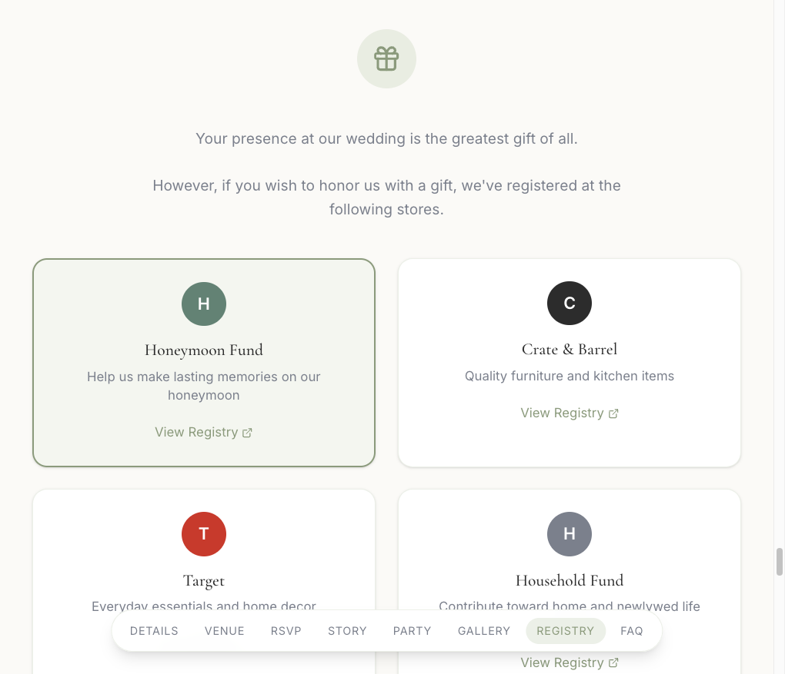
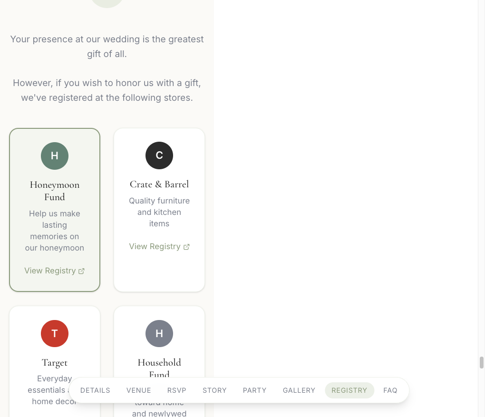

# Proof Artifacts: Spec 03 — Task 1.0 & 2.0 (Registry Honeymoon Prominence)

## Summary

Implementation of registry reordering and Honeymoon Fund prominence per Spec 03. All tasks completed in a single implementation unit.

---

## CLI Output

### Build

```bash
$ npm run build
```

```
> jackson-and-mackenzie-website@0.0.1 build
> astro build

19:20:04 [build] output: "static"
19:20:04 [build] directory: /Users/grantesparza/repos/jackson-and-mackenzie-wedding/dist/
19:20:06 [build] ✓ Completed in 1.93s.
19:20:06 [build] 1 page(s) built in 2.18s
19:20:06 [build] Complete!
```

---

## Screenshots

### Desktop (lg breakpoint, 1280×900)

Registry section showing Honeymoon Fund first with subtle emphasis (border-2, sage-dark border, soft sage-light background tint), followed by Crate & Barrel, Target, Household Fund.



### Mobile (375×812)

Registry section on mobile showing Honeymoon Fund first in the stack with same emphasis treatment.



---

## Configuration / Implementation

### Registry.astro changes

- **Order**: `registries` array reordered to: Honeymoon Fund → Crate & Barrel → Target → Household Fund
- **First-item detection**: `index === 0` used in card map
- **Emphasis styling**: `border-2 border-[var(--color-sage-dark)]`, `bg-[var(--color-sage-light)]/10` for Honeymoon Fund card
- **Motion-reduce**: `motion-reduce:transform-none motion-reduce:transition-none` on icon scale/transition

---

## Verification

### Task 1.0

| Requirement | Status |
|-------------|--------|
| Honeymoon Fund first | ✅ Verified in screenshots |
| Order: Crate & Barrel, Target, Household Fund | ✅ Verified |
| Subtle emphasis (border, background) | ✅ border-2, sage-dark border, sage-light/10 background |
| Design tokens from global.css | ✅ Uses --color-sage-dark, --color-sage-light |
| Responsive (desktop + mobile) | ✅ Screenshots confirm |

### Task 2.0

| Requirement | Status |
|-------------|--------|
| Focus styles inherited from global.css | ✅ `a:focus-visible` in global.css applies to registry links |
| Keyboard navigable (Tab, Enter) | ✅ Cards are `<a>` elements; Tab focus, Enter activates |
| motion-reduce on icon scale/transition | ✅ `motion-reduce:transform-none motion-reduce:transition-none` applied |
| Emphasis via border/background (not color alone) | ✅ Uses border-2 + bg tint; perceivable without color |
